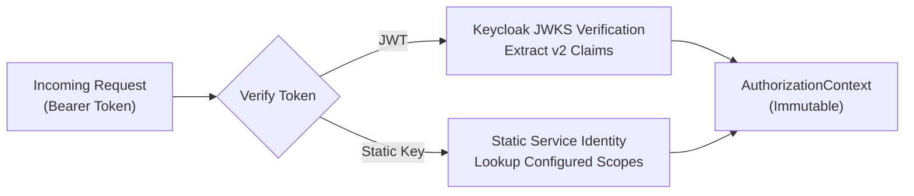
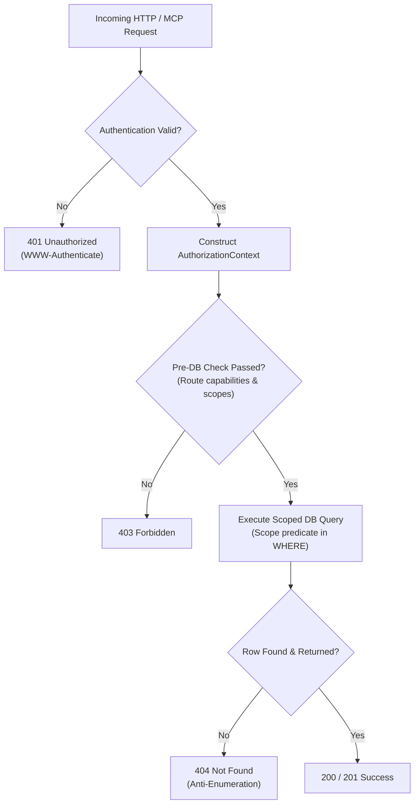

# AI-Hub Authorization Architecture Specification (v2)

**Status**: Approved Specification  
**Version**: 2.0.0  
**Target System**: AI-Hub Knowledge Hub & MCP Infrastructure  
**Author**: AI-Hub Architecture Team  
**Date**: October 2026  

---

## 1. Executive Summary & Problem Statement

AI-Hub is a multi-project Knowledge Hub and Model Context Protocol (MCP) service providing semantic search, document ingestion, and context retrieval for AI agents, developers, and autonomous systems (such as ROS2/LIMO and future projects).

### 1.1 Limitations of the Legacy (Step 1~3) Model

The legacy authorization model introduced in Steps 1~3 relied on four primary fields:
`identity`, `allowed_project_ids`, `allow_global_read`, and `allow_write`. While this provided basic project isolation and defended against ID enumeration oracles and PATCH hijacking, it exhibited structural limitations:

1. **Conflation of Global Resources and Multi-Project Access**:
   `allow_global_read` was used both to permit reading unassigned resources (`project_id IS NULL`) and as a pseudo-admin wildcard in operations such as `list_projects()`. Consequently, a service granted global read access could inadvertently see all projects.
2. **Conflation of Resource Writes and Project Administration**:
   `allow_write` governed all write operations uniformly. Having write access to a specific project permitted creating new projects or deleting projects, which should require distinct administrative privileges.
3. **REST vs. MCP Asymmetry**:
   - `GET /documents/{document_id}` in REST enforced strict project-scoped queries preventing cross-tenant information leakage.
   - MCP `get_document(document_id)` performed an unscoped database lookup whenever `allow_global_read` was true, exposing any document from any project.
   - MCP `list_skills()` required global read authorization, preventing project-scoped agents from querying skill capability metadata.
4. **Static API Key as an Anonymous Wildcard**:
   The static API key (`MCP_ACCESS_TOKEN`) was hardcoded to an implicit global-read identity rather than being treated as a configurable, explicit service identity with defined permissions.
5. **HTTP Status Code Conflation**:
   Missing or invalid authentication tokens returned `403 Forbidden` instead of standard `401 Unauthorized` with `WWW-Authenticate` headers.
6. **Cascade & Orphan Risk in Database Foreign Keys**:
   Foreign key constraints on `documents.project_id` and `memories.project_id` utilized `ON DELETE SET NULL`. Deleting a project silently reassigned its resources to `project_id = NULL`, promoting private project data into globally accessible resources.
7. **Production Boundary Backdoors (`request=None`)**:
   Route handlers defined `request: Request = None` to accommodate unit tests without `TestClient`, allowing unscoped queries when `request` was not supplied.

---

## 2. Core Architecture Invariants

The v2 Authorization Architecture establishes the following mandatory invariants:

1. **Explicit Identity & Decoupled Claims**: Every request operates under a verified identity possessing explicit read scopes, write scopes, and granular capability flags.
2. **Subset Invariant**:
   $$\text{write\_project\_ids} \subseteq \text{read\_project\_ids}$$
   A principal cannot have write permission to a project without read permission to that same project.
3. **Strict Decoupling of Global Resources and Universal Access**:
   - `RESOURCE_READ_GLOBAL`: Permits reading resources where `project_id IS NULL`. Does **not** permit reading arbitrary projects.
   - `PROJECT_READ_ALL`: Permits reading across all projects regardless of project ID list.
4. **Strict Decoupling of Data Mutation and Project Management**:
   - `write_project_ids`: Permits mutating data (documents, chunks, memories) within authorized projects.
   - `PROJECT_CREATE`: Permits registering new projects.
   - `PROJECT_ADMIN`: Permits modifying project metadata or deleting projects.
5. **Strict REST $\equiv$ MCP Parity**:
   Every MCP tool enforces the exact same authorization, scoping, and data isolation semantics as its corresponding REST endpoint.
6. **Pre-DB Authorization & Anti-Enumeration Defense**:
   All requests must pass pre-DB capability and scope checks. Database queries must enforce scope filtering in the SQL `WHERE` clause, ensuring that resources outside the caller's read scope return `404 Not Found` indistinguishable from non-existent resources.
7. **Atomic Mutation (No TOCTOU)**:
   Resource updates and deletions must evaluate ownership and authorization directly within the SQL mutation statement using `RETURNING` clauses.
8. **Normalized Status Codes**:
   - Unauthenticated or invalid token $\to$ `401 Unauthorized`
   - Authenticated but unauthorized $\to$ `403 Forbidden`
   - Non-existent or inaccessible resource $\to$ `404 Not Found`
   - Project deletion blocked by existing resources $\to$ `409 Conflict`
9. **Elimination of Unit-Test Backdoors**:
   Production route handlers require `request: Request`. Unit tests must use FastAPI `TestClient` or construct test requests through standard fixtures.

---

## 3. Core Types & Capabilities

### 3.1 Capability Enumeration

```python
from enum import Enum

class Capability(str, Enum):
    """Fine-grained system capabilities decoupled from project scopes."""
    RESOURCE_READ_GLOBAL = "RESOURCE_READ_GLOBAL"   # Read global resources (project_id IS NULL)
    RESOURCE_WRITE_GLOBAL = "RESOURCE_WRITE_GLOBAL" # Create/mutate/unlink global resources (project_id IS NULL)
    PROJECT_READ_ALL = "PROJECT_READ_ALL"           # Read across all projects
    PROJECT_CREATE = "PROJECT_CREATE"               # Create new projects (POST /projects)
    PROJECT_ADMIN = "PROJECT_ADMIN"                 # Modify or delete projects (DELETE /projects/{id})
```

### 3.2 Authorization Context

```python
from dataclasses import dataclass

@dataclass(frozen=True)
class AuthorizationContext:
    """Immutable principal authorization context evaluated per request."""
    identity: str
    read_project_ids: frozenset[int] = frozenset()
    write_project_ids: frozenset[int] = frozenset()
    capabilities: frozenset[Capability] = frozenset()

    def __post_init__(self) -> None:
        if not self.identity:
            raise ValueError("Identity must not be empty")
        if not self.write_project_ids.issubset(self.read_project_ids):
            raise ValueError("write_project_ids must be a subset of read_project_ids")

    def can_read_project(self, project_id: int) -> bool:
        return Capability.PROJECT_READ_ALL in self.capabilities or project_id in self.read_project_ids

    def can_write_project(self, project_id: int) -> bool:
        return project_id in self.write_project_ids

    def can_read_global(self) -> bool:
        return Capability.RESOURCE_READ_GLOBAL in self.capabilities

    def can_write_global(self) -> bool:
        return Capability.RESOURCE_WRITE_GLOBAL in self.capabilities

    def can_create_project(self) -> bool:
        return Capability.PROJECT_CREATE in self.capabilities or Capability.PROJECT_ADMIN in self.capabilities

    def can_admin_project(self, project_id: int) -> bool:
        return Capability.PROJECT_ADMIN in self.capabilities
```

---

## 4. Claims Schema & Compatibility Layer

### 4.1 Standard Claims (v2)

Tokens (JWT or service identity configuration) supply the following claims payload:

```json
{
  "sub": "agent:robotics-nav",
  "read_project_ids": [1, 2],
  "write_project_ids": [1],
  "capabilities": ["RESOURCE_READ_GLOBAL"]
}
```

- `sub` (string, required): Unique identity of the principal.
- `read_project_ids` (array of int, optional): Project IDs the principal may read.
- `write_project_ids` (array of int, optional): Project IDs the principal may modify. Must be a subset of `read_project_ids`.
- `capabilities` (array of string, optional): List of `Capability` values.

### 4.2 Legacy Compatibility Layer (Decisions 1 & 2)

To maintain backward compatibility during migration, tokens bearing legacy Step 1~3 claims are mapped into v2 `AuthorizationContext` as follows:

| Legacy Claim | Legacy Value | Mapped v2 Field / Value | Notes |
| :--- | :--- | :--- | :--- |
| `allowed_project_ids` | `[1, 2]` | `read_project_ids = {1, 2}` | Converted to integer frozenset |
| `allow_global_read` | `true` | `capabilities |= {RESOURCE_READ_GLOBAL}` | Grants access to `project_id IS NULL` only |
| `allow_write` | `true` | `write_project_ids = read_project_ids` | **Does NOT grant** `PROJECT_CREATE` or `PROJECT_ADMIN` |
| `allow_write` | `false` | `write_project_ids = frozenset()` | Read-only access |

> [!IMPORTANT]
> Under Decision 2, legacy `allow_write: true` maps strictly to `write_project_ids = read_project_ids`. It does **not** grant `PROJECT_CREATE` or `PROJECT_ADMIN`. Legacy clients attempting to create or delete projects will be rejected with `403 Forbidden` unless their token explicitly includes the corresponding capability.

---

## 5. Service Identity & Static API Key Model (Decision 3)

The legacy behavior where any request using `MCP_ACCESS_TOKEN` was granted an implicit global wildcard is deprecated and replaced by an explicit service identity model:



### 5.1 Service Identity Configuration

1. **Explicit Identity Name**: The static key represents an explicit named principal (e.g. `service:ai-hub-mcp-internal`).
2. **Configurable Permissions**: Static key permissions are defined through configuration (e.g., environment variables or configuration dict):
   - `AIHUB_STATIC_KEY_IDENTITY`: Name of the static service identity (default: `service:static-api-key`).
   - `AIHUB_STATIC_KEY_READ_PROJECTS`: Comma-separated list of readable project IDs (or empty).
   - `AIHUB_STATIC_KEY_WRITE_PROJECTS`: Comma-separated list of writable project IDs (or empty).
   - `AIHUB_STATIC_KEY_CAPABILITIES`: Comma-separated list of capabilities (e.g. `RESOURCE_READ_GLOBAL,PROJECT_READ_ALL,PROJECT_CREATE`).
3. **Fail-Closed Guarantee**: If static key verification fails or the static service identity configuration is invalid, requests fail closed and return `401 Unauthorized`.
4. **Constant-Time Comparison**:
   All static key comparisons must use `hmac.compare_digest` to prevent timing oracle attacks:
   ```python
   import hmac

   def verify_static_key(provided_key: str, configured_key: str) -> bool:
       if not provided_key or not configured_key:
           return False
       return hmac.compare_digest(provided_key.encode("utf-8"), configured_key.encode("utf-8"))
   ```
5. **Transitional Deprecation of Query-String API Keys**:
   Passing API keys in query parameters (`?key=...`) is strictly transitional. It will be logged with a deprecation warning and phased out in favor of the standard `Authorization: Bearer <token>` header across all HTTP and MCP transports.

---

## 6. Database Schema & Resource Ownership Policy (Decision 4)

### 6.1 Foreign Key Constraint Hardening

In the baseline schema (`migrations/0001_baseline.sql`), foreign keys on `documents` and `memories` were defined as:
```sql
CONSTRAINT fk_documents_project FOREIGN KEY (project_id) REFERENCES projects(id) ON DELETE SET NULL;
CONSTRAINT fk_memories_project FOREIGN KEY (project_id) REFERENCES projects(id) ON DELETE SET NULL;
```

**v2 Policy**: Foreign keys are altered to `ON DELETE RESTRICT`:
```sql
ALTER TABLE documents DROP CONSTRAINT fk_documents_project;
ALTER TABLE documents ADD CONSTRAINT fk_documents_project
    FOREIGN KEY (project_id) REFERENCES projects(id) ON DELETE RESTRICT;

ALTER TABLE memories DROP CONSTRAINT fk_memories_project;
ALTER TABLE memories ADD CONSTRAINT fk_memories_project
    FOREIGN KEY (project_id) REFERENCES projects(id) ON DELETE RESTRICT;
```

### 6.2 Project Deletion Contract (`409 Conflict`)

When `DELETE /projects/{project_id}` is invoked:
1. The endpoint validates `PROJECT_ADMIN` capability.
2. The database checks for associated documents or memories:
   - If the project owns active resources, the deletion is aborted, and the API returns `409 Conflict`:
     ```json
     {
       "detail": "Project cannot be deleted because it contains 5 documents and 12 memories. Reassign or delete owned resources first."
     }
     ```
3. Only empty projects can be deleted, preventing accidental data orphaned or unlinked to global.

### 6.3 Resource Detachment / Unlinking Protection

Updating a resource to detach it from its project (`project_id = NULL`) changes its visibility scope to global.
- In v2, setting `project_id = NULL` on an existing project resource requires `RESOURCE_WRITE_GLOBAL`.
- Callers lacking `RESOURCE_WRITE_GLOBAL` attempting to set `project_id = NULL` receive `403 Forbidden`.

### 6.4 Historical NULL Rows

Existing database rows where `project_id IS NULL` will remain untouched. Before applying foreign key migrations, an audit query counts existing NULL rows to record baseline metrics without destructive modification.

---

## 7. HTTP Status Code & Error Handling Specification (Decision 5)

| Condition | Status Code | Error Response / Headers | Description |
| :--- | :---: | :--- | :--- |
| **Missing / Expired / Invalid Credentials** | `401` | Header: `WWW-Authenticate: Bearer error="invalid_token"`<br>`{"detail": "Authentication required or credentials invalid"}` | Principal identity could not be established. |
| **Insufficient Permissions / Capability** | `403` | `{"detail": "Forbidden: missing capability or project write permission"}` | Principal is authenticated but lacks required scope/capability. |
| **Resource Not Found or Outside Read Scope** | `404` | `{"detail": "<Resource> not found"}` | Uniform response for non-existent IDs and cross-tenant IDs (anti-enumeration). |
| **Project Deletion with Owned Resources** | `409` | `{"detail": "Project contains owned resources"}` | Project deletion prevented by `RESTRICT` constraint. |
| **Validation Error on Request Body** | `422` | `{"detail": [...]}` | Pydantic model validation failure. |

---

## 8. REST Endpoint Authorization Matrix

| Endpoint | Method | Required Scope / Capability | Pre-DB Check | Scoped SQL Predicate | Failure Status |
| :--- | :---: | :--- | :--- | :--- | :---: |
| `/healthz` | GET | None (Public) | None | None | 503 (DB down) |
| `/projects` | GET | Authenticated | Validate identity | If `PROJECT_READ_ALL`: all.<br>Else: `WHERE id = ANY(:read_project_ids)` | 401 |
| `/projects` | POST | `PROJECT_CREATE` or `PROJECT_ADMIN` | Check capability | Insert | 401, 403 |
| `/projects/{id}` | GET | Read access to `id` | `can_read_project(id)` | `WHERE id = :id` | 401, 403, 404 |
| `/projects/{id}` | PATCH | `PROJECT_ADMIN` | Check capability | `UPDATE ... WHERE id = :id` | 401, 403, 404 |
| `/projects/{id}` | DELETE | `PROJECT_ADMIN` | Check capability | `DELETE ... WHERE id = :id` (RESTRICT) | 401, 403, 404, 409 |
| `/documents` | GET | Read scope | If `project_id` given: `can_read_project(pid)` | `WHERE project_id = ANY(:read_project_ids)` (or global if allowed) | 401, 403 |
| `/documents/{id}` | GET | Read access to document's project | Validate identity | `WHERE id = :id AND (project_id = ANY(:read_pids) OR :read_all OR (:read_global AND project_id IS NULL))` | 401, 404 |
| `/documents/{id}` | PATCH | Write access to document's project | Validate identity | `UPDATE ... WHERE id = :id AND (project_id = ANY(:write_pids) OR (:write_global AND project_id IS NULL))` | 401, 404 |
| `/documents/{id}` | DELETE | Write access to document's project | Validate identity | `DELETE ... WHERE id = :id AND (project_id = ANY(:write_pids) OR (:write_global AND project_id IS NULL))` | 401, 404 |
| `/documents/upload` | POST | Write access to target `project_id` | If `pid`: `can_write_project(pid)`<br>If `None`: `can_write_global()` | Insert with target `project_id` | 401, 403 |
| `/documents/{id}/chunks` | GET | Read access to document's project | Validate identity | Scoped document lookup, then chunk fetch | 401, 404 |
| `/documents/{id}/chunks` | POST | Write access to document's project | Validate identity | Scoped document lookup, then chunk insert | 401, 404 |
| `/memories` | GET | Read scope | If `pid`: `can_read_project(pid)` | Scoped by caller read projects | 401, 403 |
| `/memories` | POST | Write access to target `project_id` | If `pid`: `can_write_project(pid)`<br>If `None`: `can_write_global()` | Insert | 401, 403 |
| `/memories/{id}` | GET | Read access to memory's project | Validate identity | `WHERE id = :id AND (project_id = ANY(:read_pids) OR :read_all OR (:read_global AND project_id IS NULL))` | 401, 404 |
| `/memories/{id}` | PATCH | Write access to source & dest project | Validate identity | Atomic UPDATE with dual-scope validation | 401, 403, 404 |
| `/memories/{id}` | DELETE | Write access to memory's project | Validate identity | `DELETE ... WHERE id = :id AND (project_id = ANY(:write_pids) OR (:write_global AND project_id IS NULL))` | 401, 404 |
| `/context/search` | POST | Read scope for `project_id` | If `pid`: `can_read_project(pid)` | Hybrid vector/text search scoped by project | 401, 403 |
| `/context/assemble`| POST | Read scope for `project_id` | If `pid`: `can_read_project(pid)` | Scoped context assembly | 401, 403 |

---

## 9. MCP Tool Authorization Matrix

| MCP Tool | Required Scope / Capability | Semantic Parity with REST | Error / Behavior Contract |
| :--- | :--- | :--- | :--- |
| `health_check` | None (Public) | Aligns with `/healthz` | Returns `{status: "ok", service: "ai-hub-mcp"}` |
| `list_projects` | Authenticated | Aligns with `GET /projects` | Filters returned projects to caller's `read_project_ids` (or all if `PROJECT_READ_ALL`). |
| `list_skills` | Authenticated | System capability metadata | Accessible to any authenticated principal. Does **not** require global read. |
| `get_document` | Read access to document's project | Aligns with `GET /documents/{id}` | **Strict scoping enforced**: Queries with scope filter. If document is outside caller's read scope, returns `ResourceNotFound` (indistinguishable from missing ID). |
| `search_context`| Read access to target `project_id` | Aligns with `POST /context/search` | If `project_id` supplied, validates `can_read_project(pid)`. If `None`, searches across caller's allowed read projects. |
| `get_context` | Read access to target `project_id` | Aligns with `POST /context/assemble`| Scoped canonical context assembly matching REST. |

---

## 10. Pre-DB Authorization & Atomic Query Scoping Patterns

### 10.1 Request Evaluation Pipeline



### 10.2 SQL Query Patterns

#### Scoped Resource Retrieval (Anti-Enumeration Pattern)
```sql
SELECT id, project_id, title, status, ...
FROM documents
WHERE id = %(document_id)s
  AND (
      project_id = ANY(%(read_project_ids)s)
      OR %(can_read_all)s
      OR (%(can_read_global)s AND project_id IS NULL)
  );
```
- If the document does not exist $\to$ returns 0 rows $\to$ 404.
- If the document exists in another project outside caller scope $\to$ returns 0 rows $\to$ 404.
- No timing or error-code distinction exists between missing and unpermitted resource IDs.

#### Atomic Mutation Pattern (Anti-TOCTOU Pattern)
```sql
UPDATE memories
SET title = %(title)s,
    content = %(content)s,
    updated_at = NOW()
WHERE id = %(memory_id)s
  AND (
      project_id = ANY(%(write_project_ids)s)
      OR (%(can_write_global)s AND project_id IS NULL)
  )
RETURNING id, project_id, title;
```
- Atomic evaluation ensures that another transaction cannot reassign or delete the resource between authorization check and mutation execution.

---

## 11. Implementation Roadmap

| Phase | Description | Deliverables |
| :---: | :--- | :--- |
| **Phase 1** | **Architecture Documentation** (This document) | `docs/AUTHORIZATION.md` |
| **Phase 2** | **Core Authorization Engine & Types** | `api/app/core/capabilities.py`, `scopes.py`, refactored `authorization.py`, comprehensive unit tests |
| **Phase 3** | **Resource Ownership Policy & DB Migration** | Migration script (`0002_restrict_project_foreign_keys.sql`), `db.py` schema updates, project deletion 409 handling |
| **Phase 4** | **REST Router Migration** | Update `documents.py`, `memories.py`, `projects.py`, `context.py`; remove `request=None` backdoors |
| **Phase 5** | **MCP Parity Migration** | Update `mcp_server.py`; scope `get_document`; loosen `list_skills` to auth-only |
| **Phase 6** | **Authentication Integration** | Update `token_verifier.py`; implement static service identity model; constant-time API key verification |
| **Phase 7** | **Security & Integration Tests** | Test suite covering 401/403/404/409, oracle defense, TOCTOU prevention, and parity |
| **Phase 8** | **Full Regression Verification** | Run complete pytest suite and verify zero regressions |
| **Phase 9** | **Documentation Harmonization** | Update `docs/architecture.md`, `docs/project-status.md`, `AGENTS.md` references |
| **Phase 10**| **Final Diff Review** | Read-only inspection of clean git diff before user approval |
