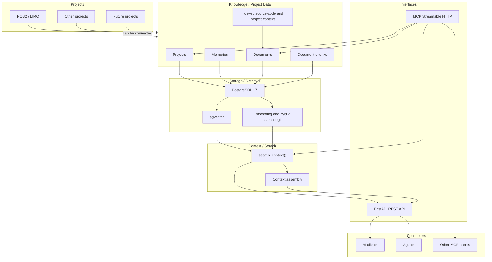
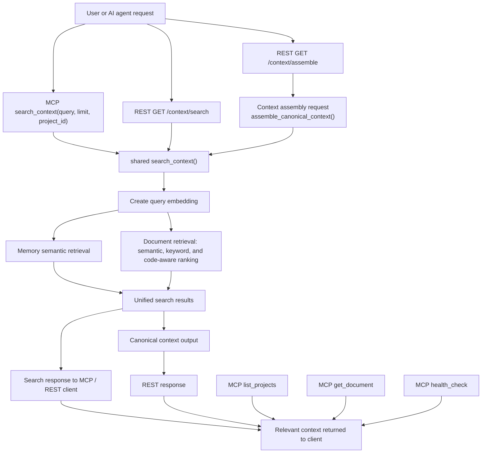
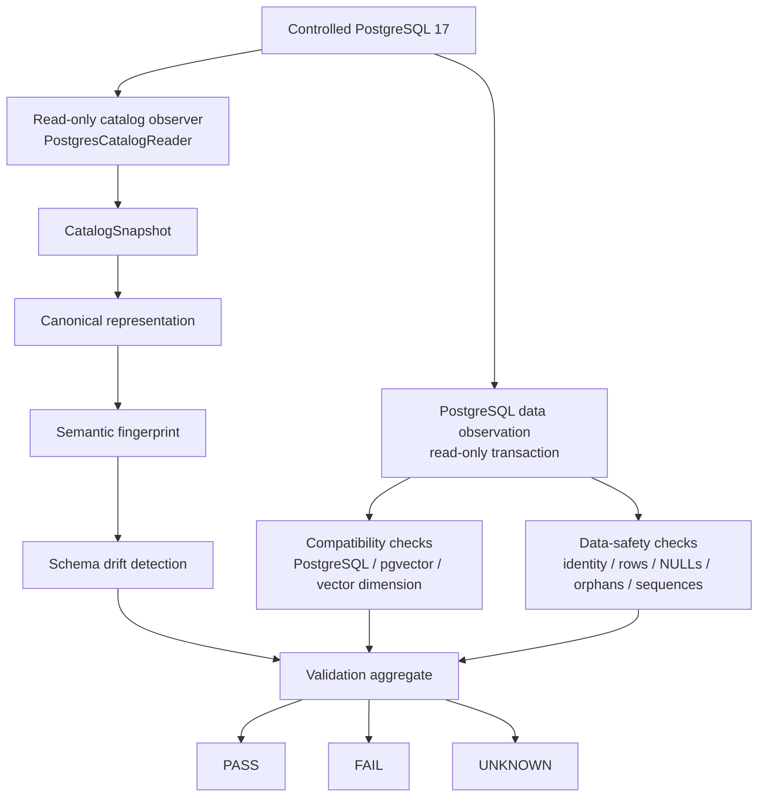

# AI-Hub Architecture

이 문서는 현재 repository에 구현된 AI-Hub 구조와 Phase A-N의
PostgreSQL validation foundation을 빠르게 파악하기 위한 안내서다.
다이어그램의 `Planned` 표시는 현재 코드에 연결되지 않은 향후 영역이며,
Production migration이나 runtime validation 완료를 의미하지 않는다.

## 1. AI-Hub 전체 Architecture

AI-Hub는 ROS2/LIMO만을 위한 서비스가 아니라 여러 프로젝트의 문서, 메모리,
소스 코드를 연결하는 Knowledge Hub와 MCP infrastructure다. 현재 구현된
저장·검색·인터페이스 계층은 다음과 같다.

현재 코드에서 PostgreSQL 연결과 pgvector 등록은
`api/app/core/db.py`, 통합 검색은 `api/app/core/search.py`, context
assembly는 `api/app/core/context_assembly.py`, REST route는
`api/app/routers/`, MCP server와 tool은 `api/app/mcp_server.py`에 있다.
`Future projects`는 연결 가능성을 나타내는 개념이며, 별도의 프로젝트
연동 구현이 이 문서에 추가된 것은 아니다.

Production migration runner, baseline registration, migration metadata
persistence, schema repair, runtime compatibility gate, runtime data-safety
gate는 이 전체 구조에서 구현된 계층이 아니다. 이들은 현재 문서의
`Planned` 또는 별도 operations 작업으로 취급한다.

## 2. AI Context Retrieval Flow

현재 MCP의 `search_context`는 REST의 `/context/search`와 같은
`app.core.search.search_context()`를 사용해 memory와 indexed document를
함께 검색한다. `list_projects`, `get_document`, `health_check`는 별도의
MCP tool이다. Context assembly는 현재 REST `/context/assemble`에 연결되어
있으며, MCP tool로 등록되어 있지는 않다.

`search_context()`는 답변을 생성하거나 LLM을 호출하지 않는다. 현재
구현은 검색 결과와 provenance-aware context를 반환하는 단계까지이며,
검색 결과로부터 답변을 생성하는 LLM workflow는 구현되어 있지 않다.

## 3. PostgreSQL Validation / Migration Foundation

다음 흐름은 `api/app/core/catalog_queries.py`,
`schema_catalog.py`, `schema_representation.py`,
`schema_fingerprint.py`, `schema_drift.py`,
`compatibility.py`, `data_safety_observer.py`,
`data_safety.py`, `schema_validation.py`에 구현된 validation foundation을
나타낸다. Catalog와 data-safety observer는 read-only transaction에서
관찰값을 수집하며, validation aggregate는 이 결과를 PASS, FAIL, UNKNOWN으로
분류한다.

Phase N의 `api/tests/test_postgres_integration.py`는 disposable
`pgvector/pgvector:pg17-bookworm` 환경에서 다음을 실제로 검증했다.

- PostgreSQL 17과 pgvector version
- database/schema identity와 실제 catalog
- `CatalogSnapshot`
- canonical representation
- semantic fingerprint와 name-only/semantic drift detection
- constraints, FK actions, indexes, predicates, expressions, sequence ownership
- compatibility result
- row count, NULL count, orphan count, sequence safety
- read-only transaction과 observer 전후 mutation 없음
- validation aggregate

이 결과는 **Controlled PostgreSQL validation = validated**라는 의미다.
**Production validation = not performed / separate phase**이며, 위 diagram의
`Controlled PostgreSQL 17`을 Production DB로 해석해서는 안 된다.

현재 repository에는 `migrations/0001_baseline.sql`과 migration filename,
checksum, canonical schema, fingerprint, drift, compatibility, data-safety
검사 모듈이 있다. 그러나 다음은 아직 구현되지 않았다.

- Production migration execution
- migration runner
- baseline registration
- migration metadata persistence
- runtime compatibility/data-safety gate
- schema repair

따라서 이 foundation은 schema를 변경하지 않으며, migration이나 baseline
registration을 자동으로 수행하지 않는다.
